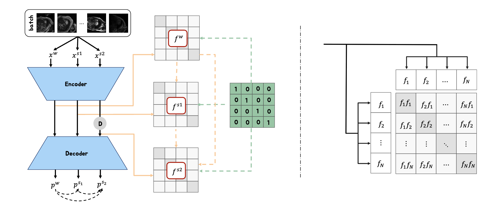
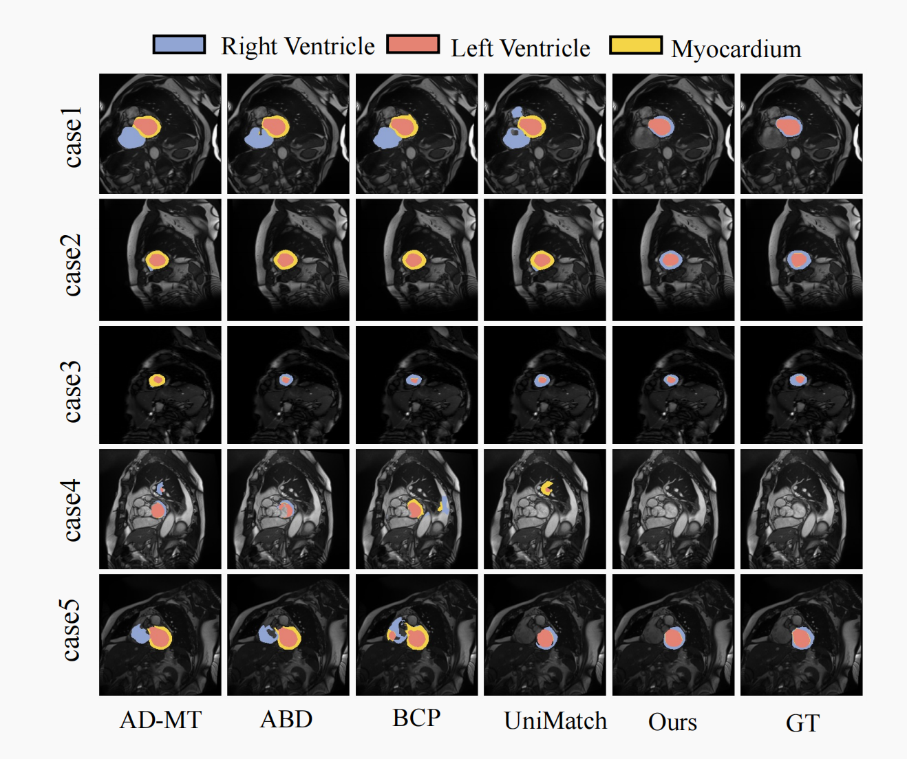

# MCFNet: A Multi-View Contrastive and Feature-Consistent Framework for Semi-Supervised Medical Image Segmentation



## Dataset
Dataset could be got by [LA](https://github.com/yulequan/UA-MT/tree/master/data) and [ACDC](https://github.com/HiLab-git/SSL4MIS/tree/master/data/ACDC) .


## Run

### ACDC
```
cd ACDC
bash train.sh
```

### LA
```
cd LA
cd code
bash train.sh
```

## Comparison with other methods




## 
Our code is largely based on [UniMatch](https://github.com/LiheYoung/UniMatch/tree/main/more-scenarios/medical).We acknowledge the valuable contributions of these authors and hope our work will positively impact future research.


